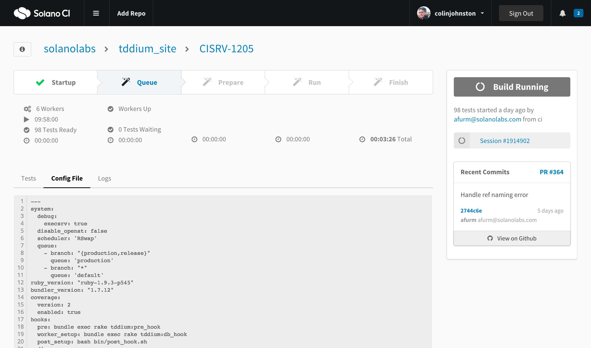
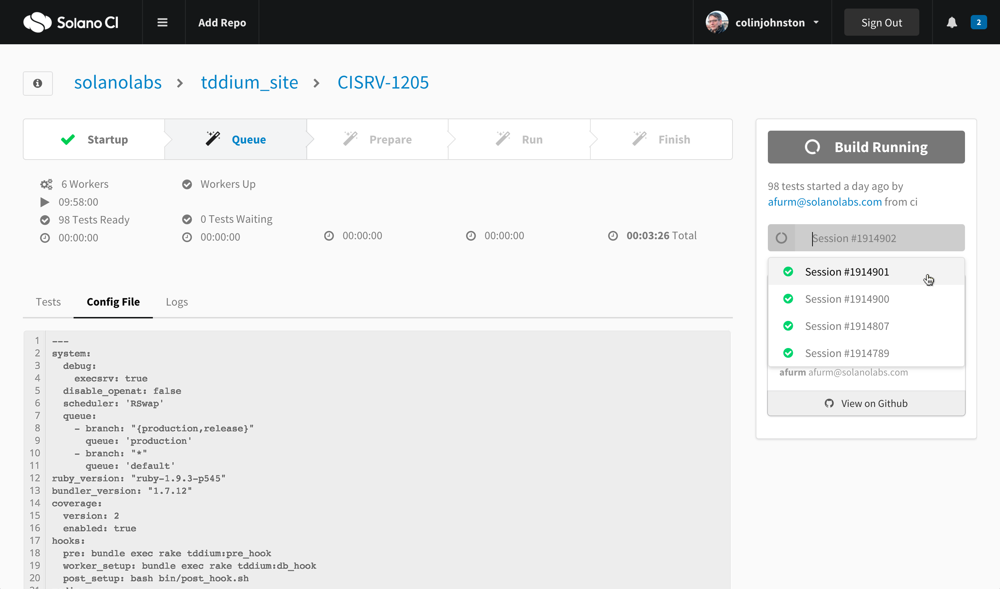
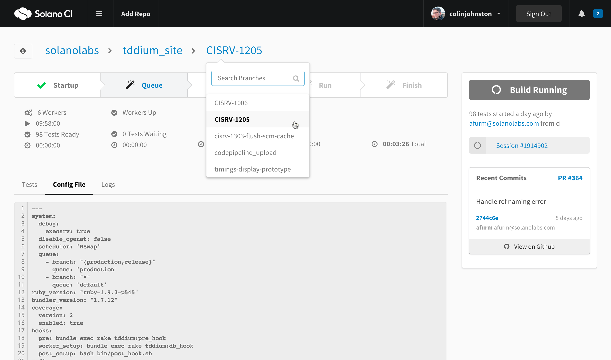
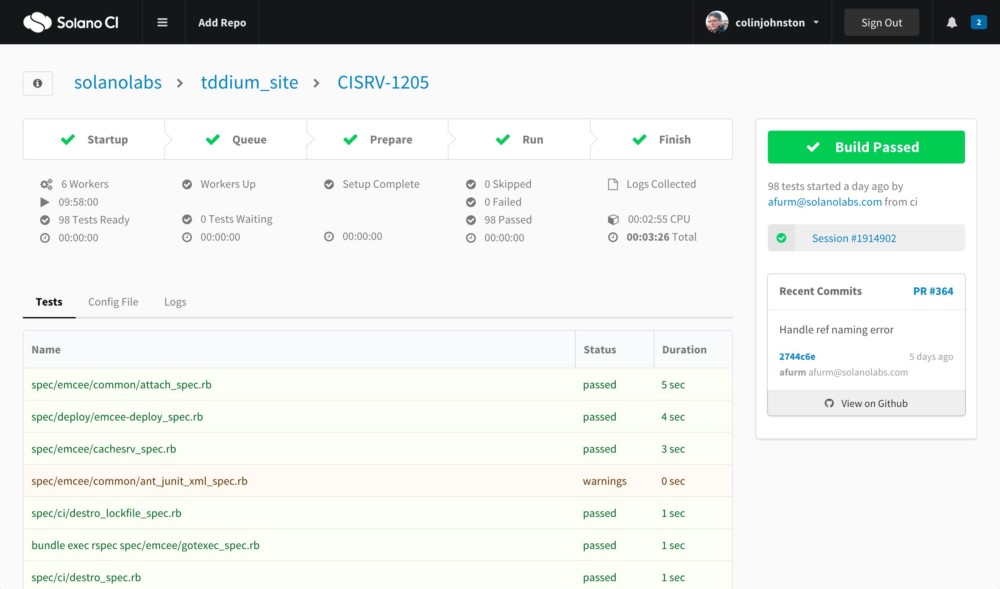
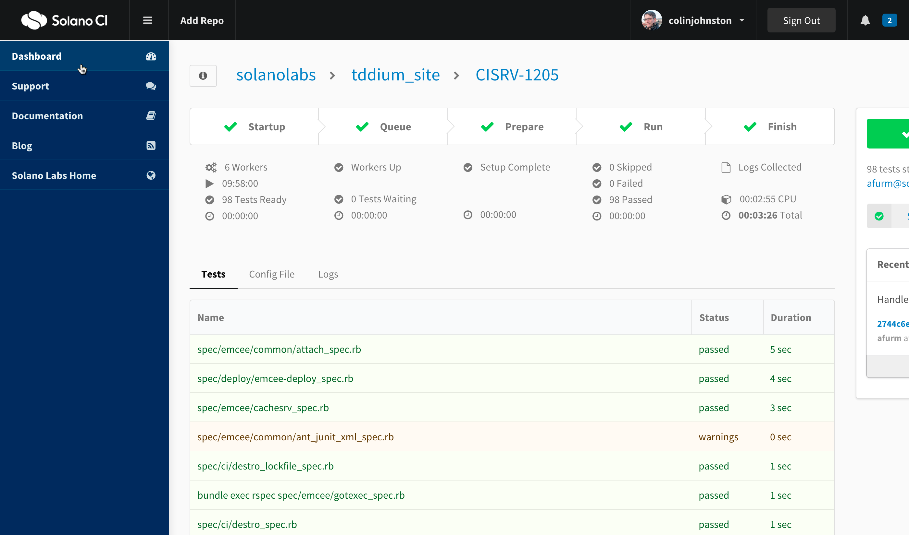

# CI Concepts #

**Visual and Interaction Design Simulation of Hypothetical v2 Solano CI**

This project was built using Semantic UI. The code structure and stylesheet patterns is not intended for use in production Solano CI app.


## concept1

#### Branch: concept1-lifecycle-steps ( on hold )


## concept2

#### Branch: master ( used in UX presentation )

1-ci-concept-main-working.png



2-ci-concept-main-working-sessionmenudown.png



3-ci-concept-main-working-branchmenudown.png



4-ci-concept-main-passed.png



5-ci-concept-main-passed-leftsidebaropen.png


6-ci-concept-main-passed-rightsidebaropen.png
![6-ci-concept-main-passed-rightsidebaropen.png]
(screenshots/6-ci-concept-main-passed-rightsidebaropen.png)


## Running Locally ##

Install Middleman: 

```
$ bundle install
```

Launch project:

```
$ bundle exec middleman server
```